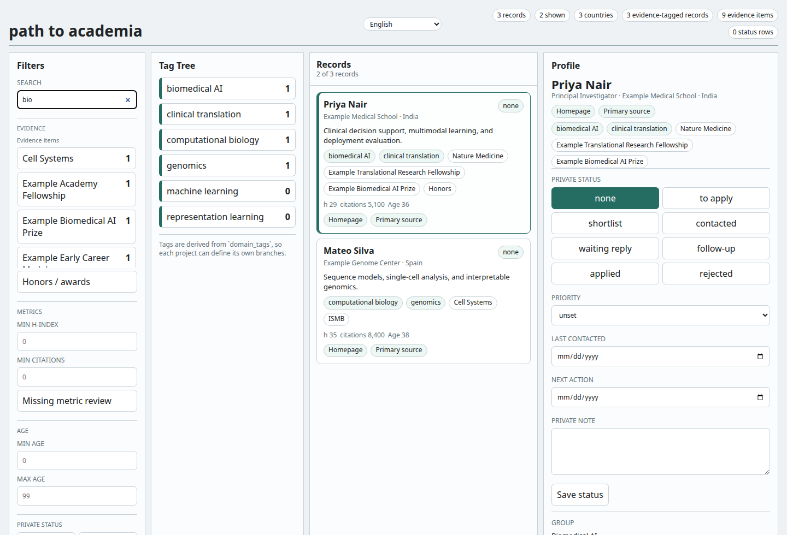

# path to academia plugin

path to academia is a plugin for Claude Code, Codex, and compatible coding agents that helps you
find potential PhD or postdoc supervisors, labs, and open academic positions.



## Getting Started

After installing, invoke `path-to-academia` and tell the agent what you want to study and where you
want to apply. It should ask the missing intake questions first.
Do not start source collection until the basic brief is clear.

## Components

| Component | Count |
|-----------|-------|
| Skills | 1 |
| Local CLI | 1 |
| Web UI | 1 |
| Example workspace | 1 |

## Bundle Contents

This installable plugin bundle contains:

- `.codex-plugin/plugin.json` for Codex metadata.
- `.claude-plugin/plugin.json` for Claude Code metadata.
- `skills/path-to-academia/SKILL.md` for the agent workflow.
- `docs/` for workflow, schema, quality, privacy, and localization notes.
- `scripts/` and `src/` for the CLI, QA, XLSX export, and local Web UI.
- `examples/ml-bio/` for the built-in demo workspace config.

The repository root registers this bundle through:

```text
.agents/plugins/marketplace.json
.claude-plugin/marketplace.json
```

## Invocation

Codex:

```text
path-to-academia
```

Claude Code:

```text
/path-to-academia:path-to-academia
```

## CLI

The Python CLI can also be used directly from this bundle:

```bash
python3 -m pip install -e .
path-to-academia init ./workspace --example ml-bio
path-to-academia context ./workspace
path-to-academia qa ./workspace
path-to-academia export-xlsx ./workspace/tables/entities_final.csv ./workspace/tables/entities_final_wrapped.xlsx
path-to-academia serve ./workspace --port 8765
```

## Documentation

- `skills/path-to-academia/SKILL.md`
- `docs/workflow.md`
- `docs/collection-playbook.md`
- `docs/schema.md`
- `docs/quality-gates.md`
- `docs/sharding.md`
- `docs/privacy.md`
